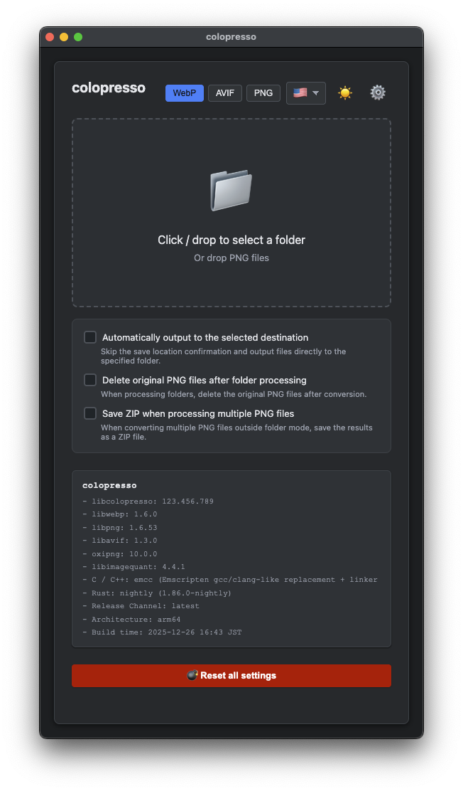

# 🎨 colopresso

<p align="center">
  
</p>

<p align="center">
  <strong>All-in-one tool for converting and optimizing PNG images to next-gen formats</strong>
</p>

<p align="center">
  <a href="./LICENSE"></a>
  
  
  
</p>

<p align="center">
  <a href="./README_ja.md">日本語</a>
</p>

---

**colopresso** is an open-source project that provides a high-performance library `libcolopresso` for converting and color-reducing PNG images to WebP, AVIF, and optimized PNG, along with CLI / GUI applications that leverage its capabilities.

<p align="center">
  
</p>

<p align="center">
  <a href="https://colopl.github.io/colopresso/"></a>
</p>

## ✨ Features

- 🚀 **Fast Conversion** — High-speed processing with a native C99-based library
- 📦 **Multiple Format Support** — WebP, AVIF, optimized PNG (256-color, Reduced RGBA32, Limited RGBA4444)
- 🖥️ **Cross-Platform** — Supports Windows, macOS, and Linux
- 🎛️ **Flexible Deployment** — Choose from CLI, Electron app, Chrome extension, or Node.js
- ⚙️ **Profile System** — Save, export, and import per-format parameters
- 🌐 **WebAssembly Support** — WASM builds that run in browsers and Node.js

## 📥 Quick Start

```bash
git clone --recursive "https://github.com/colopl/colopresso.git"
cd colopresso
```

For detailed build instructions, see the [Build Guide](#build-linux).

> [!IMPORTANT]
> **AVX2 instruction set support is required on x86_64 (amd64) platforms for CLI (native builds) and Python Wheel.**
> Intel Haswell (2013) or later, or AMD Excavator or later processors are required.
> GUI applications (Electron, Chrome Extension) use WebAssembly and do not require AVX2.

## 🎯 Supported Formats

| Format | Mode | Description |
|--------|------|-------------|
| **WebP** | Lossy / Lossless | Widely supported next-gen format |
| **AVIF** | Lossy / Lossless | Best quality next-gen format |
| **PNG** | 256-color Palette | 256-color quantization (with protected colors) |
| **PNG** | Reduced RGBA32 | Bit depth reduction (preserves 8-bit RGBA output) |
| **PNG** | Limited RGBA4444 | Prevents banding artifacts in RGBA16bit and RGBA4444 |
| **PNG** | Lossless | Optimization through metadata removal |

### 📱 Format Selection Guide

| Target Device | Recommended Format |
|--------------|-------------------|
| iOS 16+ | **AVIF** (Best quality) |
| iOS 14+ | **WebP** |
| Earlier than iOS 14 | **PNG** |

> [!NOTE]
> Android 5.x and later rely on Chromium (Google Chrome), so all formats are supported.

## 🛠️ Applications

### CLI

A fast command-line tool that runs in the console.

- ✅ Fully utilizes OS-level multithreading and CPU extensions
- ✅ Available on Windows, Linux, and macOS
- ✅ Ideal for batch processing and CI/CD pipelines

### Electron (Desktop GUI)

A desktop application with intuitive drag & drop interface.

- ✅ Batch convert all PNG files in a folder
- ✅ Option to automatically delete original files after conversion
- ✅ Streamline workflows with profile functionality

### Chrome Extension

A lightweight conversion tool that runs in the browser.

- ✅ Download converted files directly from Chrome
- ✅ Download multiple files as a ZIP archive

> [!NOTE]
> The official Chrome extension is not published on the Chrome Web Store. Self-hosting is recommended.

### Node.js (WebAssembly)

A WASM-based CLI that runs in Node.js environments.

- ✅ Run `colopresso.js` directly with Node.js 18+
- ✅ Ideal for server-side image processing

### Python

Python bindings available on PyPI for easy integration.

- ✅ Simple `pip install colopresso`
- ✅ Supports WebP, AVIF, and optimized PNG encoding
- ✅ Fast OS-native processing, same as CLI
- ✅ Available for Windows, macOS, and Linux (x64/ARM64)

For detailed API documentation, see [python/README.md](./python/README.md).

---

## 📚 Detailed Documentation

<details>
<summary><strong>📖 Table of Contents</strong></summary>

- [Development Environment](#development-environment)
- [Build Options](#build-options)
- [Build (Linux)](#build-linux)
- [Build (macOS)](#build-macos)
- [Build (Node.js)](#build-nodejs)
- [Build (Chrome Extension)](#build-chrome-extension)
- [Build (Electron)](#build-electron)
- [License](#license)
- [Authors](#authors)
- [Notices](#notices)

</details>

---

## Development Environment

```bash
git clone --recursive "https://github.com/colopl/colopresso.git"
```

Open the cloned `colopresso` directory with Visual Studio Code and attach to the Dev Container using the `Dev Containers` extension.

> [!NOTE]
> When MemorySanitizer runs on arm64 with SIMD (NEON) enabled, `libpng` might be flagged for reading uninitialized memory. We currently disable SIMD (NEON) during MemorySanitizer runs.

> [!NOTE]
> On i386 / amd64, enabling assembly while using MemorySanitizer may trigger false positives in `libaom`. We currently disable assembler code when running MemorySanitizer.

> [!NOTE]
> With multithreading enabled, Valgrind / MemorySanitizer may report uninitialized memory access or leaked resources because of Rayon's design. Suppression files are provided to mitigate this.

## Build Options

### Always Available

| Option | Default | Description |
|--------|---------|-------------|
| `COLOPRESSO_USE_CLI` | OFF | Enables building the CLI binary. Requires `COLOPRESSO_WITH_FILE_OPS=ON`. |
| `COLOPRESSO_USE_UTILS` | OFF | Builds code under `library/utils/`. Automatically disabled if `COLOPRESSO_WITH_FILE_OPS=OFF`. |
| `COLOPRESSO_USE_TESTS` | OFF | Builds code under `library/tests/`. |
| `COLOPRESSO_WITH_FILE_OPS` | ON | Enables file I/O APIs (`cpres_encode_*_file`). Forced to `OFF` when Chrome Extension or Electron builds are enabled. |

### GCC && Debug Mode

| Option | Description |
|--------|-------------|
| `COLOPRESSO_USE_VALGRIND` | Enables Valgrind integration if available. |
| `COLOPRESSO_USE_COVERAGE` | Enables `gcov` coverage if available. |

### Clang && Debug Mode

| Option | Description |
|--------|-------------|
| `COLOPRESSO_USE_ASAN` | Enables AddressSanitizer. |
| `COLOPRESSO_USE_MSAN` | Enables MemorySanitizer. |
| `COLOPRESSO_USE_UBSAN` | Enables UndefinedBehaviorSanitizer. |

## Build (Linux)

1. Install VS Code and Docker (or compatible software), then open the repository directory
2. Attach using Dev Containers
3. Run the following commands:

```bash
rm -rf "build" && cmake -B "build" -DCMAKE_BUILD_TYPE=Release \
  -DCOLOPRESSO_USE_UTILS=ON -DCOLOPRESSO_USE_TESTS=ON -DCOLOPRESSO_USE_CLI=ON
cmake --build "build" --parallel
ctest --test-dir "build" --output-on-failure --parallel
```

4. `./build/cli/colopresso` contains the CLI binary, `./build/utils` contains utility binaries, and `./build` contains `libcolopresso.a`

### Coverage Output

```bash
rm -rf "build" && cmake -B "build" -DCMAKE_BUILD_TYPE=Debug \
  -DCOLOPRESSO_USE_COVERAGE=ON -DCOLOPRESSO_USE_TESTS=ON
cmake --build "build" --parallel
cmake --build "build" --target coverage
```

Coverage reports are generated under `./build/coverage/html/`.

### Valgrind Check

```bash
rm -rf "build" && cmake -B "build" -DCMAKE_BUILD_TYPE=Debug \
  -DCOLOPRESSO_USE_VALGRIND=ON -DCOLOPRESSO_USE_TESTS=ON
cmake --build "build" --parallel
ctest --test-dir "build" --output-on-failure --parallel
```

<details>
<summary><strong>Valgrind Options Details</strong></summary>

The Valgrind test suite includes encoder end-to-end tests and can be extremely slow in CI environments.

| Option | Default | Description |
|--------|---------|-------------|
| `COLOPRESSO_VALGRIND_TRACK_ORIGINS` | OFF | When `ON`, adds `--track-origins=yes`. **Very slow**, but helps trace uninitialized value origins. |
| `COLOPRESSO_VALGRIND_RAYON_NUM_THREADS` | 1 | Sets `RAYON_NUM_THREADS` for Valgrind tests. |
| `COLOPRESSO_VALGRIND_LEAK_CHECK` | full | Controls Valgrind `--leak-check` (`no|summary|full`). |
| `COLOPRESSO_VALGRIND_SHOW_LEAK_KINDS` | all | Controls Valgrind `--show-leak-kinds`. |

**Example: Fast CI-like Valgrind run:**

```bash
rm -rf "build" && cmake -B "build" -DCMAKE_BUILD_TYPE=Debug \
  -DCOLOPRESSO_USE_VALGRIND=ON -DCOLOPRESSO_USE_TESTS=ON \
  -DCOLOPRESSO_VALGRIND_TRACK_ORIGINS=OFF -DCOLOPRESSO_VALGRIND_RAYON_NUM_THREADS=1
```

**Example: Run only a specific test:**

```bash
ctest --test-dir "build" --output-on-failure -R '^test_encode_pngx_memory_valgrind$'
```

</details>

### Sanitizer Check

```bash
rm -rf "build" && cmake -B "build" \
  -DCMAKE_C_COMPILER="$(command -v clang)" \
  -DCMAKE_CXX_COMPILER="$(command -v clang++)" \
  -DCMAKE_BUILD_TYPE=Debug \
  -DCOLOPRESSO_USE_ASAN=ON -DCOLOPRESSO_USE_TESTS=ON
cmake --build "build" --parallel
ctest --test-dir "build" --output-on-failure --parallel
```

## Build (macOS)

1. Install `cmake` via Homebrew (and `nasm` on Intel CPUs)
2. Navigate to the clone directory in your terminal
3. Run the following commands:

```bash
rm -rf "build" && cmake -B "build" -DCMAKE_BUILD_TYPE=Release \
  -DCOLOPRESSO_USE_UTILS=ON -DCOLOPRESSO_USE_TESTS=ON -DCOLOPRESSO_USE_CLI=ON
cmake --build "build" --parallel
ctest --test-dir "build" --output-on-failure --parallel
```

4. `./build/cli/colopresso` contains the CLI binary, `./build/utils` contains utility binaries, and `./build` contains `libcolopresso.a`

## Build (Node.js)

1. Install VS Code and Docker (or compatible software), then open the repository directory
2. Attach using Dev Containers
3. Run the following commands:

```bash
rm -rf "build" && emcmake cmake -B "build" -DCMAKE_BUILD_TYPE=Release \
  -DCOLOPRESSO_USE_UTILS=ON -DCOLOPRESSO_USE_TESTS=ON \
  -DCOLOPRESSO_USE_CLI=ON -DCOLOPRESSO_NODE_BUILD=ON
cmake --build "build" --parallel
ctest --test-dir "build" --output-on-failure --parallel
```

4. `./build/cli/colopresso.js` / `colopresso.wasm` are generated

## Build (Chrome Extension)

1. Install VS Code and Docker (or compatible software), then open the repository directory
2. Attach using Dev Containers
3. Run the following commands:

```bash
rm -rf "build" && emcmake cmake -B "build" -DCMAKE_BUILD_TYPE=Release \
  -DCOLOPRESSO_CHROME_EXTENSION=ON
cmake --build "build" --parallel
```

4. Extension build artifacts are placed under `./build/chrome`

## Build (Electron)

### Common Requirements

- Node.js
- Rust nightly
  ```bash
  rustup toolchain install nightly
  rustup component add "rust-src" --toolchain nightly
  rustup target add "wasm32-unknown-emscripten"
  rustup target add "wasm32-unknown-unknown"
  ```
- LLVM / Clang with `wasm32-unknown-unknown` support
  - macOS: `brew install llvm`
- EMSDK installed at the same tag as `third_party/emsdk`
- `emcmake` / `cmake` accessible via `PATH`

> [!NOTE]
> File I/O APIs are automatically disabled for Electron builds; only memory APIs remain available.

### macOS

> [!TIP]
> Refer to `release.yaml` whenever you need the authoritative, up-to-date sequence of steps.

```bash
# 1. Set up EMSDK
cd third_party/emsdk
./emsdk install <tag>
./emsdk activate <tag>
source ./emsdk_env.sh
cd ../..

# 2. Build
rm -rf "build" && emcmake cmake -B "build" \
  -DCOLOPRESSO_ELECTRON_APP=ON -DCOLOPRESSO_ELECTRON_TARGETS="--mac"
cmake --build "build" --config Release --parallel
```

Artifacts are output to `dist_build/colopresso_macos_gui_{x64,arm64}.dmg`.

### Windows

> [!TIP]
> Always use `pwsh` instead of cmd (Command Prompt).

```powershell
# 1. Set up EMSDK
cd third_party/emsdk
.\emsdk.ps1 install <tag>
.\emsdk.ps1 activate <tag>
. .\emsdk_env.ps1
cd ..\..

# 2. Build
rm -rf "build"
emcmake cmake -B "build" -DCOLOPRESSO_ELECTRON_APP=ON -DCOLOPRESSO_ELECTRON_TARGETS="--win"
cmake --build "build" --config Release --parallel
```

Artifacts are output as `dist_build/colopresso_windows_gui_{x64,arm64}.exe`.

---

## License

**GNU General Public License v3.0 (GPLv3)**

See [LICENSE](./LICENSE) for details.

## Authors

- **Go Kudo** <g-kudo@colopl.co.jp>
- Icon resource designed by **Moana Sato**

## Notices

See [NOTICE](./NOTICE).

This software was developed with the assistance of Large Language Models (LLMs).
All design decisions were made by humans, and all LLM-generated code has been reviewed and verified for correctness and compliance.

The icons and graphical assets for this software were created without the use of generative AI.
Files in the `assets/` directory are test images generated programmatically from Python code.

**Coding agents used:**

- GitHub, Inc. / GitHub Copilot
- Anthropic PBC / Claude Code
- Anysphere, Inc. / Cursor
