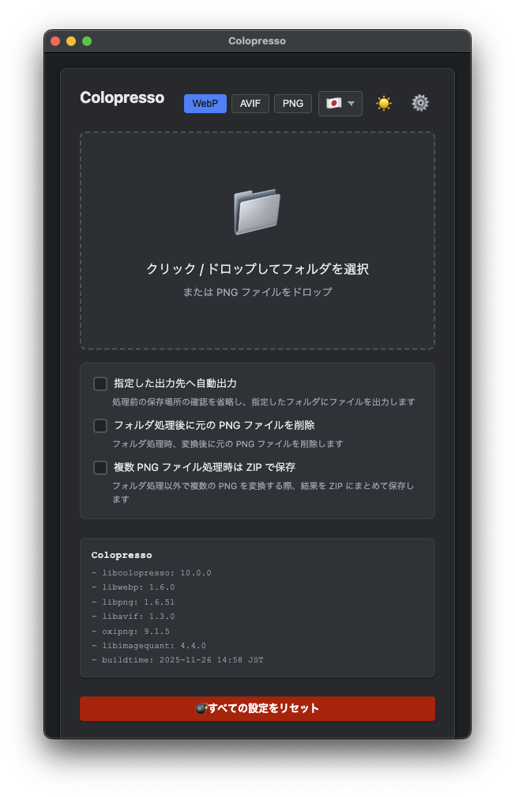

# 🎨 colopresso

<p align="center">
  
</p>

<p align="center">
  <strong>PNG 画像を次世代フォーマットに変換・最適化するオールインワンツール</strong>
</p>

<p align="center">
  <a href="./LICENSE"></a>
  
  
  
</p>

<p align="center">
  <a href="./README.md">English</a>
</p>

---

**colopresso** は、PNG 画像を WebP、AVIF、最適化 PNG へ変換・減色圧縮するための高性能ライブラリ `libcolopresso` と、その機能を活用した CLI / GUI アプリケーションを提供するオープンソースプロジェクトです。

<p align="center">
  
</p>

<p align="center">
  <a href="https://colopl.github.io/colopresso/"></a>
</p>

## ✨ 特長

- 🚀 **高速変換** — C99 ベースのネイティブライブラリによる高速処理
- 📦 **複数フォーマット対応** — WebP, AVIF, 最適化 PNG (256色, Reduced RGBA32, Limited RGBA4444)
- 🖥️ **マルチプラットフォーム** — Windows, macOS, Linux に対応
- 🎛️ **柔軟な利用形態** — CLI, Electron アプリ, Chrome 拡張機能, Node.js から選択可能
- ⚙️ **プロファイル機能** — フォーマットごとのパラメータを保存・エクスポート・インポート
- 🌐 **WebAssembly 対応** — ブラウザや Node.js で動作する WASM ビルドもサポート

## 📥 クイックスタート

```bash
git clone --recursive "https://github.com/colopl/colopresso.git"
cd colopresso
```

詳細なビルド手順は [ビルドガイド](#ビルド-linux) を参照してください。

> [!IMPORTANT]
> **CLI (ネイティブビルド) および Python Wheel は、x86_64 (amd64) 環境で AVX2 命令セットのサポートが必須です。**
> 2013年以降の Intel Haswell 以降、または AMD Excavator 以降のプロセッサが必要です。
> GUI アプリケーション (Electron、Chrome Extension) は WebAssembly を使用するため、AVX2 は不要です。

## 🎯 対応フォーマット

| フォーマット | モード | 説明 |
|-------------|--------|------|
| **WebP** | 圧縮 / ロスレス | 広く対応した次世代フォーマット |
| **AVIF** | 圧縮 / ロスレス | 最高品質の次世代フォーマット |
| **PNG** | 256色パレット | 256色量子化 (保護色指定あり) |
| **PNG** | Reduced RGBA32 | ビット深度削減 (8-bit RGBA 出力を維持) |
| **PNG** | Limited RGBA4444 | 誤差拡散ディザリング付き量子化 |
| **PNG** | ロスレス | メタデータ削除による最適化 |

### 📱 フォーマット選択ガイド

| 対応デバイス | 推奨フォーマット |
|-------------|-----------------|
| iOS 16+ | **AVIF** (最高品質) |
| iOS 14+ | **WebP** |
| iOS 14 未満 | **PNG** |

> [!NOTE]
> Android 5.x 以降は常に Chromium (Google Chrome) に依存しているため、すべてのフォーマットがサポートされています。

## 🛠️ アプリケーション

### CLI

コンソールで動作する高速コマンドラインツールです。

- ✅ OS レベルのマルチスレッドと CPU 拡張命令を最大限に活用
- ✅ Windows, Linux, macOS で利用可能
- ✅ バッチ処理や CI/CD パイプラインに最適

### Electron (デスクトップ GUI)

直感的なドラッグ&ドロップ操作が可能なデスクトップアプリケーションです。

- ✅ フォルダ内のすべての PNG ファイルを一括変換
- ✅ 変換後に元ファイルを自動削除するオプション
- ✅ プロファイル機能でワークフローを効率化

### Chrome 拡張機能

ブラウザ上で動作する軽量な変換ツールです。

- ✅ 変換ファイルを Chrome から直接ダウンロード
- ✅ 複数ファイルを ZIP アーカイブとしてダウンロード可能

> [!NOTE]
> 公式の Chrome 拡張機能は Chrome ウェブストアでは公開されていません。セルフホストでの利用を推奨します。

### Node.js (WebAssembly)

Node.js 環境で動作する WASM 版 CLI です。

- ✅ Node.js 18 以降で `colopresso.js` を直接実行可能
- ✅ サーバーサイドでの画像処理に最適

### Python

PyPI で公開されている Python バインディングで簡単に統合できます。

- ✅ `pip install colopresso` でインストール
- ✅ WebP、AVIF、最適化 PNG エンコードをサポート
- ✅ Windows、macOS、Linux (x64/ARM64) で利用可能

詳細な API ドキュメントは [python/README_ja.md](./python/README_ja.md) を参照してください。

---

## 📚 詳細ドキュメント

<details>
<summary><strong>📖 目次</strong></summary>

- [開発環境](#開発環境)
- [ビルドオプション](#ビルドオプション)
- [ビルド (Linux)](#ビルド-linux)
- [ビルド (macOS)](#ビルド-macos)
- [ビルド (Node.js)](#ビルド-nodejs)
- [ビルド (Chrome Extension)](#ビルド-chrome-extension)
- [ビルド (Electron)](#ビルド-electron)
- [ライセンス](#ライセンス)
- [作者](#作者)
- [特記事項](#特記事項)

</details>

---

## 開発環境

```bash
git clone --recursive "https://github.com/colopl/colopresso.git"
```

クローンした `colopresso` ディレクトリを Visual Studio Code で開き、`Dev Containers` 拡張機能を使用して Dev Container にアタッチしてください。

> [!NOTE]
> SIMD (NEON) を有効にした arm64 上で MemorySanitizer を実行すると、`libpng` が未初期化メモリの読み取りとしてフラグ付けされる場合があります。現在、MemorySanitizer の実行中は SIMD (NEON) を無効にしています。

> [!NOTE]
> i386 / amd64 上で MemorySanitizer を使用しながらアセンブリを有効にすると、`libaom` で誤検知が発生する場合があります。現在、MemorySanitizer の実行中はアセンブラコードを無効にしています。

> [!NOTE]
> マルチスレッドを有効にすると、Rayon の設計により Valgrind / MemorySanitizer が未初期化メモリアクセスやリソースリークを報告する場合があります。これを軽減するための抑制ファイル (suppression files) が提供されています。

## ビルドオプション

### 常に利用可能

| オプション | デフォルト | 説明 |
|-----------|-----------|------|
| `COLOPRESSO_USE_CLI` | OFF | CLI バイナリのビルドを有効にします。`COLOPRESSO_WITH_FILE_OPS=ON` が必要です。 |
| `COLOPRESSO_USE_UTILS` | OFF | `library/utils/` 以下のコードをビルドします。`COLOPRESSO_WITH_FILE_OPS=OFF` の場合、自動的に無効になります。 |
| `COLOPRESSO_USE_TESTS` | OFF | `library/tests/` 以下のコードをビルドします。 |
| `COLOPRESSO_WITH_FILE_OPS` | ON | ファイル I/O API (`cpres_encode_*_file`) を有効にします。Chrome Extension または Electron ビルドを有効にすると、強制的に `OFF` になります。 |

### GCC && Debug モード

| オプション | 説明 |
|-----------|------|
| `COLOPRESSO_USE_VALGRIND` | 利用可能な場合、Valgrind 統合を有効にします。 |
| `COLOPRESSO_USE_COVERAGE` | 利用可能な場合、`gcov` カバレッジを有効にします。 |

### Clang && Debug モード

| オプション | 説明 |
|-----------|------|
| `COLOPRESSO_USE_ASAN` | AddressSanitizer を有効にします。 |
| `COLOPRESSO_USE_MSAN` | MemorySanitizer を有効にします。 |
| `COLOPRESSO_USE_UBSAN` | UndefinedBehaviorSanitizer を有効にします。 |

## ビルド (Linux)

1. VS Code と Docker (または互換ソフトウェア) をインストールし、リポジトリディレクトリを開きます
2. Dev Containers を使用してアタッチします
3. 以下のコマンドを実行します:

```bash
rm -rf "build" && cmake -B "build" -DCMAKE_BUILD_TYPE=Release \
  -DCOLOPRESSO_USE_UTILS=ON -DCOLOPRESSO_USE_TESTS=ON -DCOLOPRESSO_USE_CLI=ON
cmake --build "build" --parallel
ctest --test-dir "build" --output-on-failure --parallel
```

4. `./build/cli/colopresso` に CLI バイナリが、`./build/utils` にユーティリティバイナリが、`./build` に `libcolopresso.a` が生成されます

### カバレッジ出力

```bash
rm -rf "build" && cmake -B "build" -DCMAKE_BUILD_TYPE=Debug \
  -DCOLOPRESSO_USE_COVERAGE=ON -DCOLOPRESSO_USE_TESTS=ON
cmake --build "build" --parallel
cmake --build "build" --target coverage
```

カバレッジレポートは `./build/coverage/html/` 以下に生成されます。

### Valgrind チェック

```bash
rm -rf "build" && cmake -B "build" -DCMAKE_BUILD_TYPE=Debug \
  -DCOLOPRESSO_USE_VALGRIND=ON -DCOLOPRESSO_USE_TESTS=ON
cmake --build "build" --parallel
ctest --test-dir "build" --output-on-failure --parallel
```

<details>
<summary><strong>Valgrind オプションの詳細</strong></summary>

Valgrind のテストはエンコーダのエンドツーエンド系テストを含むため、CI 環境では非常に時間がかかる場合があります。

| オプション | デフォルト | 説明 |
|-----------|-----------|------|
| `COLOPRESSO_VALGRIND_TRACK_ORIGINS` | OFF | `ON` にすると `--track-origins=yes` を付与。**非常に遅くなります**が、未初期化値の発生源追跡に有効です。 |
| `COLOPRESSO_VALGRIND_RAYON_NUM_THREADS` | 1 | Valgrind テスト実行時の `RAYON_NUM_THREADS` を設定します。 |
| `COLOPRESSO_VALGRIND_LEAK_CHECK` | full | Valgrind の `--leak-check` を指定します (`no|summary|full`)。 |
| `COLOPRESSO_VALGRIND_SHOW_LEAK_KINDS` | all | Valgrind の `--show-leak-kinds` を指定します。 |

**例: CI 向け (高速) の Valgrind 実行:**

```bash
rm -rf "build" && cmake -B "build" -DCMAKE_BUILD_TYPE=Debug \
  -DCOLOPRESSO_USE_VALGRIND=ON -DCOLOPRESSO_USE_TESTS=ON \
  -DCOLOPRESSO_VALGRIND_TRACK_ORIGINS=OFF -DCOLOPRESSO_VALGRIND_RAYON_NUM_THREADS=1
```

**例: 特定のテストのみ実行:**

```bash
ctest --test-dir "build" --output-on-failure -R '^test_encode_pngx_memory_valgrind$'
```

</details>

### Sanitizer チェック

```bash
rm -rf "build" && cmake -B "build" \
  -DCMAKE_C_COMPILER="$(command -v clang)" \
  -DCMAKE_CXX_COMPILER="$(command -v clang++)" \
  -DCMAKE_BUILD_TYPE=Debug \
  -DCOLOPRESSO_USE_ASAN=ON -DCOLOPRESSO_USE_TESTS=ON
cmake --build "build" --parallel
ctest --test-dir "build" --output-on-failure --parallel
```

## ビルド (macOS)

1. Homebrew 経由で `cmake` をインストールします (Intel CPU の場合は `nasm` も)
2. ターミナルでクローンディレクトリに移動します
3. 以下のコマンドを実行します:

```bash
rm -rf "build" && cmake -B "build" -DCMAKE_BUILD_TYPE=Release \
  -DCOLOPRESSO_USE_UTILS=ON -DCOLOPRESSO_USE_TESTS=ON -DCOLOPRESSO_USE_CLI=ON
cmake --build "build" --parallel
ctest --test-dir "build" --output-on-failure --parallel
```

4. `./build/cli/colopresso` と `./build/utils/cpres` に実行可能ファイルが、`./build` に `libcolopresso.a` が生成されます

## ビルド (Node.js)

1. VS Code と Docker (または互換ソフトウェア) をインストールし、リポジトリディレクトリを開きます
2. Dev Containers を使用してアタッチします
3. 以下のコマンドを実行します:

```bash
rm -rf "build" && emcmake cmake -B "build" -DCMAKE_BUILD_TYPE=Release \
  -DCOLOPRESSO_USE_UTILS=ON -DCOLOPRESSO_USE_TESTS=ON \
  -DCOLOPRESSO_USE_CLI=ON -DCOLOPRESSO_NODE_BUILD=ON
cmake --build "build" --parallel
ctest --test-dir "build" --output-on-failure --parallel
```

4. `./build/cli/colopresso.js` / `colopresso.wasm` が生成されます

## ビルド (Chrome Extension)

1. VS Code と Docker (または互換ソフトウェア) をインストールし、リポジトリディレクトリを開きます
2. Dev Containers を使用してアタッチします
3. 以下のコマンドを実行します:

```bash
rm -rf "build" && emcmake cmake -B "build" -DCMAKE_BUILD_TYPE=Release \
  -DCOLOPRESSO_CHROME_EXTENSION=ON
cmake --build "build" --parallel
```

4. 拡張機能のビルド成果物は `./build/chrome` 以下に配置されます

## ビルド (Electron)

### 共通要件

- Node.js
- Rust nightly
  ```bash
  rustup toolchain install nightly
  rustup component add "rust-src" --toolchain nightly
  rustup target add "wasm32-unknown-emscripten"
  rustup target add "wasm32-unknown-unknown"
  ```
- `wasm32-unknown-unknown` をサポートする LLVM / Clang
  - macOS: `brew install llvm`
- `third_party/emsdk` と同じタグでインストールされた EMSDK
- `PATH` 経由でアクセス可能な `emcmake` / `cmake`

> [!NOTE]
> Electron ビルドではファイル I/O API が自動的に無効になり、メモリ API のみが利用可能になります。

### macOS

> [!TIP]
> 信頼できる最新の手順が必要な場合は、常に `release.yaml` を参照してください。

```bash
# 1. EMSDK のセットアップ
cd third_party/emsdk
./emsdk install <tag>
./emsdk activate <tag>
source ./emsdk_env.sh
cd ../..

# 2. ビルド
rm -rf "build" && emcmake cmake -B "build" \
  -DCOLOPRESSO_ELECTRON_APP=ON -DCOLOPRESSO_ELECTRON_TARGETS="--mac"
cmake --build "build" --config Release --parallel
```

成果物は `dist_build/colopresso-<version>_{x64,arm64}.dmg` に出力されます。

### Windows

> [!TIP]
> cmd (コマンドプロンプト) ではなく、常に `pwsh` を使用してください。

```powershell
# 1. EMSDK のセットアップ
cd third_party/emsdk
.\emsdk.ps1 install <tag>
.\emsdk.ps1 activate <tag>
. .\emsdk_env.ps1
cd ..\..

# 2. ビルド
rm -rf "build"
emcmake cmake -B "build" -DCOLOPRESSO_ELECTRON_APP=ON -DCOLOPRESSO_ELECTRON_TARGETS="--win"
cmake --build "build" --config Release --parallel
```

成果物は `dist_build/colopresso-<version>_{ia32,x64,arm64}.exe` として出力されます。

---

## ライセンス

**GNU General Public License v3.0 (GPLv3)**

詳細は [LICENSE](./LICENSE) を参照してください。

## 作者

- **Go Kudo** <g-kudo@colopl.co.jp>
- Icon resource designed by **Moana Sato**

## 特記事項

[NOTICE](./NOTICE) を参照してください。

このソフトウェアは、大規模言語モデル (LLM) の支援を受けて開発されました。
すべての設計上の決定は人間によって行われ、LLM によって生成されたすべてのコードは、正確性とコンプライアンスについてレビューおよび検証されています。

このソフトウェアのアイコンおよびグラフィックアセットは、生成 AI を使用せずに作成されました。
`assets/` ディレクトリ内のファイルは、Python コードからプログラム的に生成されたテスト用画像です。

**使用されたコーディングエージェント:**

- GitHub, Inc. / GitHub Copilot
- Anthropic PBC / Claude Code
- Anysphere, Inc. / Cursor
